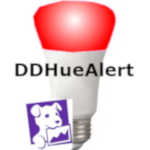

# DDHueAlert


This is a small python script that you can run as a scheduled task using either the 
Windows Scheduler or as Linux Cron jobs and can flash your Philips Hue 
(https://www2.meethue.com/en-gb) based on the status of the monitors you
have set up in your Datadog (https://datadoghq.com) account.

Below is described how to get started. 

# Installing the Script
You need to have Python 3.x installed and need to run the following dependencies
```
pip install requests
pip install datadog
pip install phue
```

*Details about the library are below*

Once installed you need to press the button on your Philips Hue Bridge and then
run your script once within 30 seconds (`python DDMonitorCheck.py`) to authorise DDHueAlert script with your
Philips Hue Bridge - the script will automatically find your bridge IP - if it throws an 
exception when you run the script, then likely the python script wasn't executed within
30 seconds of the button on top of the bridge being pressed. 

# Setting up
Now that you have the script installed and authorised with your bridge now its
time to set up your Datadog API key and app key and the options for when you want to 
be alerted.

1. In the main method towards the bottom of the script
you should see an object created called dd_options. This contains two keys
api_key and app_key. Fill these in with your key, they can be retrieved
from your account on the datadog website (https://app.datadoghq.com/account/settings#api).
Its recommended to create a new API key and App Key that is used for this script. 

2. There's an option object in the method `flash_lights`. This contains
 some options on when you should be alerted, for example, you can have it set up 
 to always flash your lights when a triggered Datadog monitor is found or only during
 active monitoring hours so you don't get woken up. By default active hours alerting is 
 turned on and the active hours are between 09:00 and 22:00. You can amend these
 to your needs (times have to be in 24 hour format) or you can set `alert_active_hours_only`
 to '0' so that you always get an alert. 
 
 # How does it work?
 The script runs once and finishes. It could be done as a loop and keeps going to 
 sleep but thought run once and finish was the best option as you don't need
 to worry about creating start up scripts or worry about the script dying for some reason
 and not restarting. 
 
 You can run it as often as you like, but bear in mind there may be some usage limits
 with the Datadog API. I've been making it run every 5 minutes on a Linux server
 in a cron job. 
 
 When the script runs, it connects to the bridge to ensure its authenticated.
 It then checks all of the monitors under your datacount account and creates
 a count of warning and critical alerts. If there's warnings and critical alerts
 the lights will flash red and then revert to their original state. 
 
 The script updates a file in the path of the script called alert_count.json. 
 This provides a history of what was triggered the last time it ran. 
 
 If the script runs again and previously the critical count > 0 and the warning count
 was greater than 0, but now the critical count = 0, then the lights flash orange
 to show that state has now changed to warning. 
 
 When the script runs again, if one or more of the counts were greater than 0 on the 
 last run, but now both counts retrieved are now 0, then the lights flash green so you 
 know everythings been resolved. 
 
 The file stops the lights flashing every single time it runs so please
 make sure that where the script runs from has read/write access to that directory
 to avoid flashing your Philips Hue lights unnecessarily. 
 
 # What if I Don't Have Philips Hue Colour Bulbs?
 Its no problem, the script will still work, obviously won't show the colours though?
 
 The script goes through all bulbs, light strips ets and checks their type. If they are detected
 as a colour bulb then they will have their colour updated to match the datadog monitor severity. If the
 bulb is detected as a non colour bulb, e.g. Philips Hue Ambient White Light Bulb, then the bulb will just
 flash. 
 
 # Thanks to the following libraries
 **Requests - https://pypi.org/project/requests/**: Used for sending API 
 requests to the Datadog API.
 
 **Datadog - https://docs.datadoghq.com/integrations/python/:** Python
 library to access your Datadog account via Datadog's API
 
 **phue - https://github.com/studioimaginaire/phue**: Python library
 for interacting with the Philips Hue API.
 
 *This project is in no way affiliated with Datadog (https://datadoghq.com) or
 Philips Hue (https://meethue.com).*
 
 *Boardies IT Solutions can take no responsibility for any unexpected or unintended
 additional costs from your Datadog Account or any unexpected or unintended
 damage to your Philips Hue devices or property. This is provided as is and there are 
 no guarantees or warranties associated with this project*
 
 If you need any help, then please feel free to contact me either via here or by raising
 a support ticket at https://support.boardiesitsolutions.com.  
 
Boardies IT Solutions - Copyright &copy; 2020

 